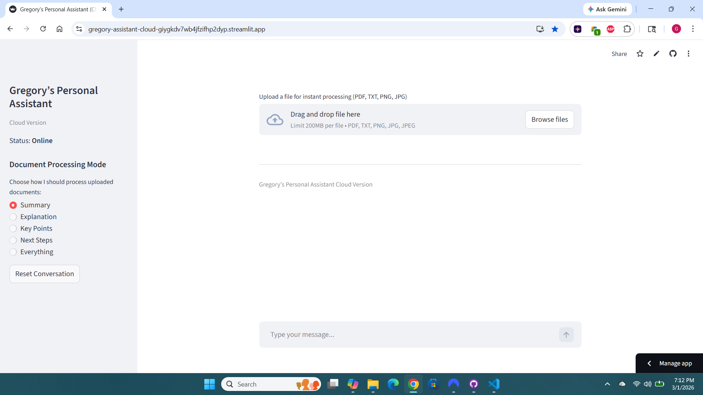

# Gregory’s Personal Assistant — Clarity‑Engine Edition

A streamlined, document‑focused assistant designed for fast, predictable, and distraction‑free processing across summary, explanation, key‑point extraction, next‑step generation, and structured rewrites.

[](Screenshot 2026-03-01 191302.png)

---

## Why This Exists

Most AI tools try to do everything and end up feeling noisy, unpredictable, and overloaded. Gregory’s Personal Assistant takes the opposite approach. It is intentionally narrow, structured, and reliable — a clarity engine designed for people who value order, precision, and workflow momentum. Every mode is predictable. Every transformation is consistent. The interface stays out of the way so the work can stay front and center.

---

## What This Tool Does

Gregory’s Personal Assistant is a focused, document‑driven clarity engine built for people who need clean, structured output without the noise of a traditional chatbot. It turns any uploaded file into clear summaries, explanations, key‑point lists, next‑step plans, and professional rewrites — all inside a minimal, predictable interface designed for real work. The tool removes friction from everyday workflows by giving you instant, high‑quality output you can use in client deliverables, internal documentation, and personal systems.

It’s built for users who value structure, speed, and reliability. Every mode produces consistent, binder‑ready results, and the transformation tools let you instantly reshape a document into the exact format you need — simpler, more formal, email‑ready, checklist‑ready, or step‑by‑step. The assistant stays out of the way so the work can stay front and center, making it a practical addition to any professional workflow.

---

## Core Features

### Document Processing Modes

Five focused modes turn any uploaded file into clean, structured output. Each mode is designed for fast comprehension and immediate use in client deliverables, internal documentation, or personal systems.

- **Summary** — Condenses the document into a clear, high‑level overview.  
- **Explanation** — Breaks down complex material into accessible, digestible language.  
- **Key Points** — Extracts the essential ideas with zero filler.  
- **Next Steps** — Generates actionable, logically ordered steps aligned with professional workflows.  
- **Everything** — Produces all four outputs at once for a complete clarity package.

### Instant Rewrite & Transformation Tools

A suite of one‑click transformations reshapes any document into the exact format you need.

- Rewrite simpler for clarity and accessibility.  
- Rewrite more formal for client‑facing or executive communication.  
- Rewrite as email for immediate outreach or follow‑up.  
- Rewrite as checklist for task‑driven workflows.  
- Rewrite as step‑by‑step plan for structured execution.  
- Explain deeper for training, onboarding, or technical understanding.

### Clean, Predictable Interface

The layout is intentionally minimal, with no distractions or unnecessary UI elements. Every interaction is designed to feel immediate and tool‑like, reinforcing the clarity‑engine philosophy of predictable, repeatable output.

### Fast, Frictionless Workflow

The assistant processes documents instantly and displays results in a stable, centered output panel. Upload a file, choose a mode, and receive structured output without navigating menus or waiting for page reloads.

### Cloud + Local Parity

The cloud version mirrors the local version’s behavior, ensuring consistent results whether you’re working on your desktop or accessing the tool remotely. The experience is unified, reliable, and intentionally simple.

### Broad File Support

Upload common formats without conversion or preprocessing.

- PDF  
- TXT  
- PNG  
- JPG / JPEG  

### Reset‑Ready Design

A single click resets the conversation and clears the interface, allowing you to start fresh without refreshing the page or losing your workflow rhythm.

---

## How It Works

### Upload a Document

Drag in a PDF, TXT, PNG, JPG, or JPEG. The assistant immediately ingests the file and prepares it for processing. There’s no configuration, no menus, and no setup — the workflow begins the moment the file is added.

### Choose a Processing Mode

Select the output style you need from the left‑side mode selector. Each mode is intentionally narrow and predictable, producing clean, structured results every time.

### Review the Output

The processed result appears in the centered output panel in a clean, readable format. The layout keeps your attention on the content, not the interface.

### Apply Transformations

Use the Additional Options panel to reshape the document into the exact format you need. Transformations are immediate and consistent.

### Reset and Start Fresh

A single reset clears the interface and returns the assistant to a ready state, keeping the workflow clean and preventing clutter.

---

## Supported File Types

Your assistant accepts the most common formats used in professional and personal workflows:

- **PDF** — Ideal for client deliverables, reports, scanned documents, and exported materials.  
- **TXT** — Perfect for raw notes, drafts, logs, and lightweight text files.  
- **PNG** — Supports screenshots, diagrams, and image‑based content.  
- **JPG / JPEG** — Handles photos, scanned pages, and mobile captures.

These formats cover the majority of everyday use cases, allowing users to drop in whatever they have and get structured output instantly.

---

## Local and Cloud Versions

### Local Version

Runs directly on the user’s machine for maximum speed and privacy. Ideal for offline work, sensitive documents, or environments where local control is preferred.

### Cloud Version

Accessible from any device with an internet connection. Offers the same clean layout, processing modes, and transformation tools.

### Unified Experience

Both versions share the same clarity‑engine philosophy: predictable output, minimal UI, and instant results. Users can switch between local and cloud without adjusting their workflow.

---

## License

```
MIT License

Copyright (c) 2026 Gregory

Permission is hereby granted, free of charge, to any person obtaining a copy
of this software and associated documentation files (the “Software”), to deal
in the Software without restriction, including without limitation the rights
to use, copy, modify, merge, publish, distribute, sublicense, and/or sell
copies of the Software, and to permit persons to whom the Software is
furnished to do so, subject to the following conditions:

The above copyright notice and this permission notice shall be included in
all copies or substantial portions of the Software.

THE SOFTWARE IS PROVIDED “AS IS”, WITHOUT WARRANTY OF ANY KIND, EXPRESS OR
IMPLIED, INCLUDING BUT NOT LIMITED TO THE WARRANTIES OF MERCHANTABILITY,
FITNESS FOR A PARTICULAR PURPOSE AND NONINFRINGEMENT. IN NO EVENT SHALL THE
AUTHORS OR COPYRIGHT HOLDERS BE LIABLE FOR ANY CLAIM, DAMAGES OR OTHER
LIABILITY, WHETHER IN AN ACTION OF CONTRACT, TORT OR OTHERWISE, ARISING
FROM, OUT OF OR IN CONNECTION WITH THE SOFTWARE OR THE USE OR OTHER
DEALINGS IN THE SOFTWARE.
```